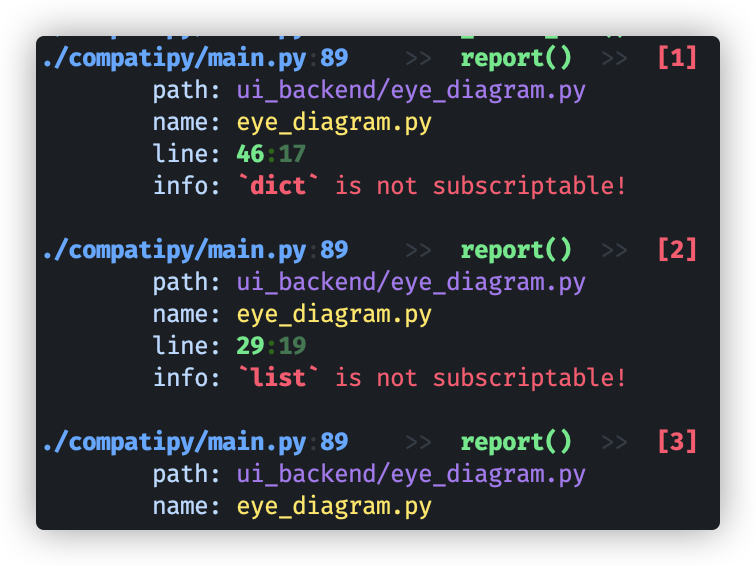

# CompatiPy

## Download

1. Download ".whl" package from release page.
2. Pip install it:

    ```shell
    pip install <path/to/compatipy-0.2.0a1-py3-none-any.whl>
    ```

## Usage

Command usage:

```shell
py -m compatipy check-py38 <path/to/project/src/folder>
```

Screenshot:


